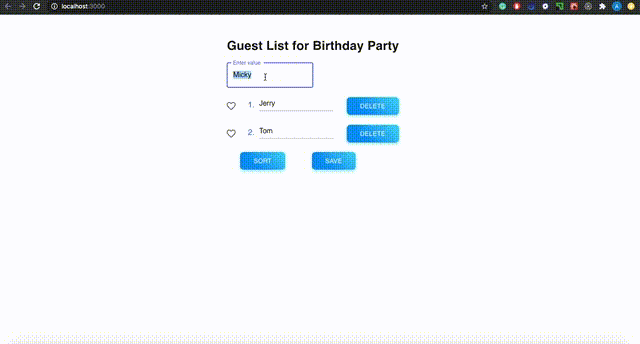

# TodoList
A simpe and easy-to-use to-do list apllication using ReactJs.



In this project I mastered:

* React
* React Hooks
* react-create-app
* material-ui


## Features

A few of the things you can do with TodoList:

* Add a new to-do item just by pressing 'Enter'
* Manage your to-do list with Localstorage
* Sort items by alphabet in ascending and descending order
* Edit an existing to-do item
* Save your changes with a 'Save' button
* Press 'Delete' and then 'Save' buttons to delete item and save changes

## How To Use

To clone and run this application, you'll need Git and Node.js (which comes with npm) installed on your computer.
* clone or download the repo
* ``` cd my-app ```
* ``` npm install ``` to install the dependencies
* ``` npm start``` to run the app

